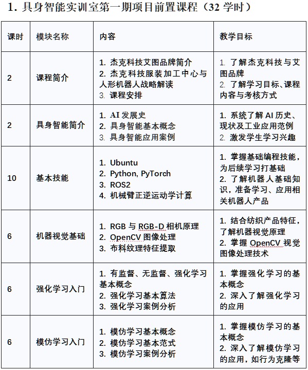
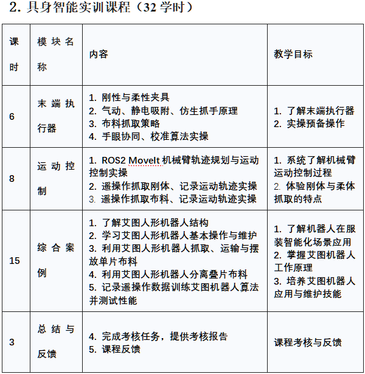

# 课前准备 
*如计算机已安装了PyTorch环境请忽略，如不确信请照以下步骤做一遍。建议课前安装，依据网络情况整个过程耗时大约1小时。*

**Windows 11**: 
建议安装Anaconda，通过其navigator找到Jupyter Notebook并使用，您需要手动安装PyTorch，具体方法请自行检索或询问教师。

**Ubuntu 22.04/24.04**:

1. 创建一个conda环境, **python版本不高于3.11**： ```conda create -n pytorch_env python=3.11```
2. 激活此环境： ```conda activate pytorch_env```
3. 安装PyTorch： ```pip install torch torchvision```
4. 安装相关模块： ```pip install torchsummary jupyter ipykernel matplotlib certifi```
5. 运行Jupyter Notebook，调试程序： ```jupyter notebook```

PyTorch环境安装完毕，在此环境中运行Jupyter Notebook。

# 具身智能实训课程二个阶段安排如下




