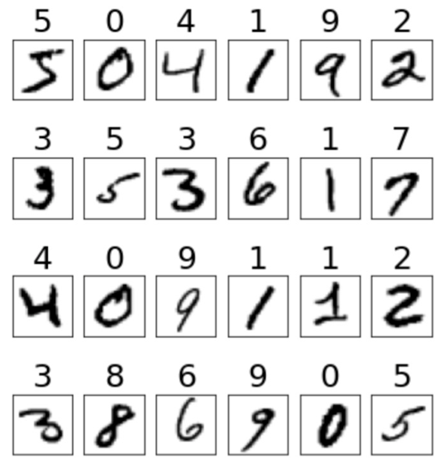

## PyTorch简介

PyTorch是目前最流行的深度学习训练、验证框架，与Python无缝衔接，包含若干重要的Python函数库。本案例以MNIST手写数字库为例学习采用PyTorch构建神经网络的方法。学完此案例后您可依据自己的兴趣在网上寻找相关开源数据库进一步学习其他案例，如车牌识别、工业品瑕疵分类识别等等，基本分类识别方法和识别MNIST数据集中的手写数字类似。

MNIST库包含7万个手写的单个数字（0-9），其中6万个数字构成训练集，1万个构成测试集，下图为24幅手写数字的例子，手写数字上方数字是该手写字的真实值标签，每个手写数字以28*28像素的黑白图像呈现。

#### 首先，让我们构建神经网络架构

将2D图像展平为1D单个像素阵列，得到28*28=784个像素，由同样数量的输入节点接收。输入和输出层之间设计有二个隐藏层。第一个隐藏层设计采用96个神经元，激活函数为tanh,**随机**设置其中20%神经元不活动以引入随机噪声，防止过拟合，提升泛化性（此为设计神经网络时常用的dropout方法）。第二个隐藏层由256个神经元构成，使用和第一层相同的dropout技术。输出层为10个节点，分别代表0-9输出数字。

全网为全连接形式，可训练参数量为102,762，计算如下：

* 第一隐藏层参数量： 784 * 96 + 96 = 75,360 （权重值和偏置值）
* 第二隐藏层参数量： 96 * 256 +256 = 24,832 （权重值和偏置值）
* 输出层： 256 * 10 + 10 = 2,570

#### 采用PyTorch和Jupyter Notebook实现神经网络，见本子目录中二个notebook文档，分别为训练和测试notebook，可单步执行。

